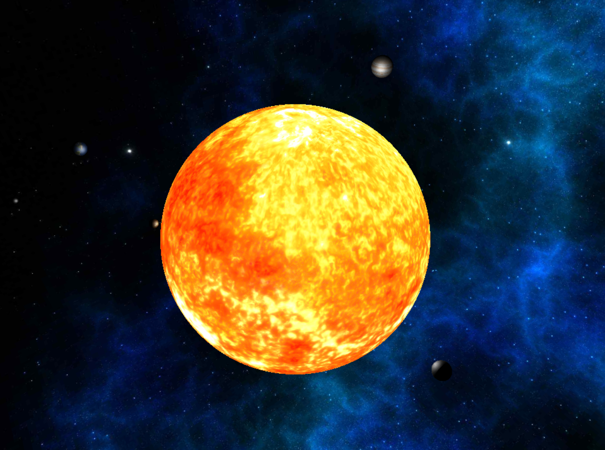
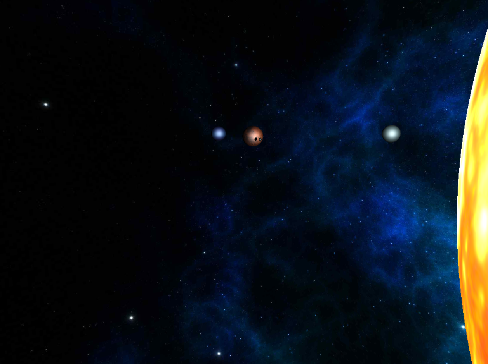
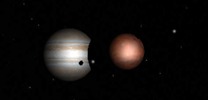

# Ray tracing solar system in OpenGL

This project is a OpenGL application, which models a solar system using Ray tracing. The solar system contains planets of more types and one or more suns.

## Tasks

In this project the following were my duties:

1. **Implementation of Ray tracing shader:** My job was to implement the Ray tracing algorithm in the shader. This shader is responsible for tracing the rays, checking for intersections with objects, and simulating shadow effects.

2. **Dynamic adjustment of Ray tracing depth:** I have implemented in the project that the Ray tracing depth can be adjusted dynamically using keyboard buttons. The users can increase or decrease the maximum Ray tracing depth in real time.

## Screenshots

Below are some screenshots showcasing the project.

